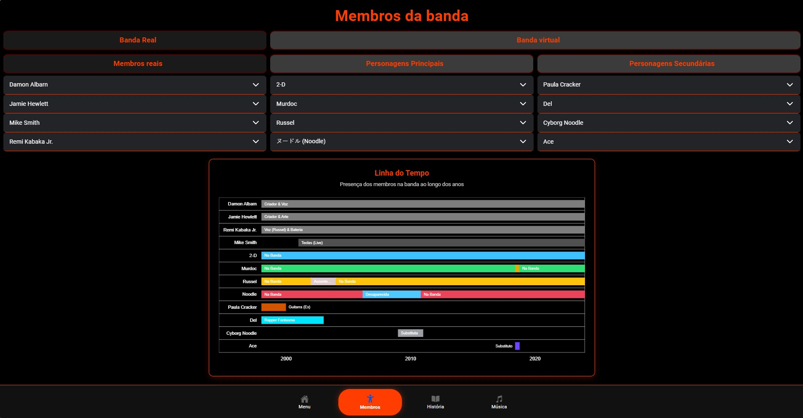

# App Ionic React - Wiki Gorillaz

Este projeto demonstra a criação de uma interface web usando **Ionic React**.

### Sobre este Projeto
Devido a limitações atuais da api selecionada da **RapidAPI** utilizada, a aplicação não consegue carregar alguns dos dados em tempo real neste momento, coisa que no momento do desnvolvimento funcionava da maneira pretendida. 

**Para visualizar o resultado final e a UI implementada, consulte as capturas de ecrã abaixo.** O código fonte está disponível para análise da lógica de componentes e integração, sobretudo da parte limitida.

### Capturas de Ecrã

*Visualização da interface principal.*
